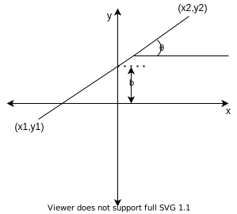

Machine Learning $\subset$ Artificial Intelligence  
The backbone tools I will be using PySpark and PyTorch.  
Machine Learning:
* Reinforcement Learning.
* Supervised Learning.
* Unsupervised Learning.

## Terminology
* Model:
A model is a function $f$ such that $f(x)=tranformed*x$. For example, a Support Vector Machine Soft classifier is a model. 
* Bias
  > High biased model which did not perform well in training process.
  > how far datapoints are from where they should be located.
  > more amount when there's no pattern between feature columns and target columns
  low is good
* Variance
  > High variance model did not performed well in  prediction.
  low is good
* underfitting
* overfitting

## classification problem:
|                  |continuous attr|multivalued attr|categorical attr|
|------------------|---------------|----------------|----------------|
|continuous target |Neural Network|Neural Network|Neural Network|
|multivalued target|Neural Network|Neural Network|Neural Network|
|categorical target|Neural Network|Neural Network|Neural Network|
## regression problem:
|                  |continuous attr|multivalued attr|categorical attr|
|------------------|---------------|----------------|----------------|
|continuous target |Neural Network|Neural Network|Neural Network|
|multivalued target|Neural Network|Neural Network|Neural Network|
|categorical target|Neural Network|Neural Network|Neural Network|


* target column is multiclass or random numbers
* attributes column can be multiclass or random numbers
* more than two attribute
* one attribute
* attribute contains multi values, eg[0.1,0.3,0.4] in attribute1
* linearly separable 
* non-linear separable

Supervised Regression Problem Solution:
* Linear Regression Formula with Optimization Algorithm(can say single neuron without activation)
* Decision Tree with Tree Spliting Techniques which uses Variance reduction or Standard deviation Reduction.
* Neural Network Structure with Optimization Algorithm.

Supervised Classification Problem Solution:
* Neural Network Structure with Optimization Algorithm.
* Decision Tree with Tree Splitting Techniques which uses Entroy Information Gain, Gini Index, Gini Ratio.
* Support Vector Machine with optimization Algorithm.

Unsupervised Classification Problem Solution:
* Clustering using K-Means with Eucledian Distance


In Practical to Perform desired Algorithm Data needs to be in specific format, Tensor.
Tensor Types:
* rank 0 : Scalar   :   int
* rank 1 : 1D Array :   [int, int, int,...]   
* rank 2 : 2D Array :   [[int, int,..],[int, int,...]]
* rank 3 : 3D Array :   [[[int, int, ...],[int, int, ...]],[[int, int, ...],[int, int, ...]]]
  
Operation Performed On Tensor is important because then we can feed the desired shape to Algorithm. For Artificial neuron for a layer which is initialized using input and output shape, it will tweak the size of weight matrix. Below are example where i is an input and w is a weight and v is the output    
* for 3 neuron input and 1 value as output to feed into 1 neuron
      
    [$w_{11},w_{21},w_{31}$][$i_1,i_2,i_3$]$^T=[w_{11}i_1+w_{21}i_2+w_{31}i_3]=[v_1]^T$  
* for 3 neuron input and 2 value as output to feed into 2 neurons
      
    [[$w_{11},w_{21},w_{31}$],[$w_{12},w_{22},w_{32}$]]$^T$[$i_1,i_2,i_3$]$^T=[[w_{11}i_1+w_{21}i_2+w_{31}i_3],[w_{12}i_1+w_{22}i_2+w_{32}i_3]]^T=[v_1,v_2]^T$


RNN:  
```
w=word
s=sentence
[
    [w1s1],[w1s2],[w1s3] ...
    [w2s1],[w2s2],[w2s3] ...
    [w3s1],[w3s2],[w3s3] ...
    .
    .
    .
](sequence_size x batch_size)
size_row  = sequence_size
size_col  = batch_size
size_elem = input_size
```
input data = ["time is money 0  0","i am good  in this"]
```
we will feed 2 sentences at one time. so batch size is 2. consider sentences as 2d grid where columns are [word in position x] and rows are sentence id. now, RNN will take each column one at a time. RNN can be increased vertically which is called stacking, it rolls automatically horizontally while feeding  each column. so, basically below data can be handled by one RNN.
feeding data = 
[
    [
        ['time' word feature],
        ['i'    word feature]
    ],
    [
        ['is' word feature],
        ['am' word feature]
    ],
    [
        ['money' word feature],
        ['good'  word feature]
    ],
    [
        ['0'  word feature],
        ['in' word feature]
    ],
    [
        ['0'    word feature],
        ['this' word feature]
    ]
]
```
Linear:  
```
[
[
    [
        [
            [
                [
                    ...[feature_length]
                ]
            ]
        ]
    ]
]
]
in pytorch it can take any dimension input but the last dimension considered as input_features.
```
Conv1d:
```
batch x channel x num_features
```
Conv2d:
```
batch x channel x height x width
```
Conv3d:
```
batch x channel x depth x height x width
```

## Line - Hyperplane - slope:
* Line  in 2D space eg a line passing this two points $(x_1,y_1),(x_2,y_2)$  
equation of line = $ax+by+c=0$  
$y=\frac{-a}{b}x\frac{-c}{b}$ $[m=\frac{-a}{b}, b=\frac{-c}{b}]$   
$y=mx+b$  
```
y=mx+b
m = slope of the line
b = this value tells at where the line intecept at y axis
with m and b information we can draw a line 
                or
with 2 points on graph too we can draw a line.
``` 

  
$slope(line)=m=\frac{y_2-y_1}{x_2-x_1}$
* Hyperplane : Any Dimension  
considering $(x,y)$ as $(x_1,x_2)$ and for 3d space $(x,y,z)$ we will rename as $(x_1,x_2,x_3)$ for $n$ dimensions we can write $(x_1,x_2,x_3,x_4,...x_n)$ Also we will rename a,b,c as $w_1,w_2,w_0$ so for a line in 2d the renamed formula will be $w_1x_1+w_2x_2+w_0=0$ and formula of a plane in $n$ dimension will be $w_1x_1+w_2x_2+w_3x_3+w_4x_4+...+w_nx_n+w_0=0$ also we can represent this using vectors $[w_1,w_2,w_3,...,w_n]_{(n\times 1)}^T[x_1,x_2,x_3,...,x_n]_{(1\times n)}+w_0=0$ or we can reduce/rename it to $w^Tx+w_0=0$ things to remember that by default $w$ size is $(n\times 1)$ and $w^T$ is $(1\times n)$. 

References:
1. https://towardsdatascience.com/pytorch-layer-dimensions-what-sizes-should-they-be-and-why-4265a41e01fd
2. http://www.umsl.edu/~defreeseca/intalg/ch3extra/lines.htm