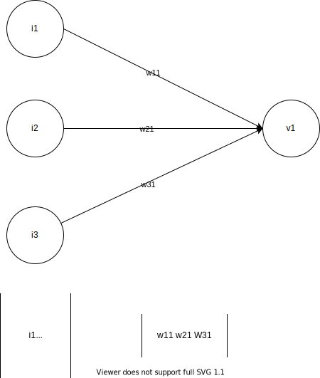
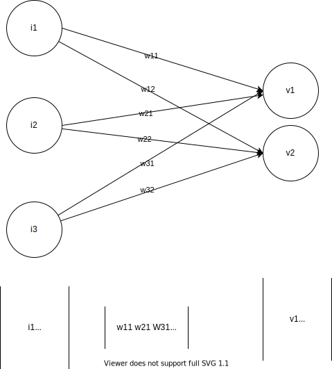

Machine Learning $\subset$ Artificial Intelligence  
The backbone tools I will be using PySpark and PyTorch.  
Machine Learning:
* Reinforcement Learning.
* Supervised Learning.
* Unsupervised Learning.

Supervised Regression Problem Solution:
* Linear Regression Formula with Optimization Algorithm(can say single neuron without activation)
* Decision Tree with Tree Spliting Techniques which uses Variance reduction or Standard deviation Reduction.
* Neural Network Structure with Optimization Algorithm.

Supervised Classification Problem Solution:
* Neural Network Structure with Optimization Algorithm.
* Decision Tree with Tree Splitting Techniques which uses Entroy Information Gain, Gini Index, Gini Ratio.
* Support Vector Machine with optimization Algorithm.

Unsupervised Classification Problem Solution:
* Clustering using K-Means with Eucledian Distance

In Practical to Perform desired Algorithm Data needs to be in specific format, Tensor.
Tensor Types:
* rank 0 : Scalar   :   int
* rank 1 : 1D Array :   [int, int, int,...]   
* rank 2 : 2D Array :   [[int, int,..],[int, int,...]]
* rank 3 : 3D Array :   [[[int, int, ...],[int, int, ...]],[[int, int, ...],[int, int, ...]]]
  
Operation Performed On Tensor is important because then we can feed the desired shape to Algorithm.  
* for 3 neuron input and 1 value as output to feed into 1 neuron
      
    [$w_{11},w_{21},w_{31}$][$i_1,i_2,i_3$]$^T=[w_{11}i_1+w_{21}i_2+w_{31}i_3]=[v_1]^T$  
* for 3 neuron input and 2 value as output to feed into 2 neurons
      
    [[$w_{11},w_{21},w_{31}$],[$w_{12},w_{22},w_{32}$]]$^T$[$i_1,i_2,i_3$]$^T=[[w_{11}i_1+w_{21}i_2+w_{31}i_3],[w_{12}i_1+w_{22}i_2+w_{32}i_3]]^T=[v_1,v_2]^T$

